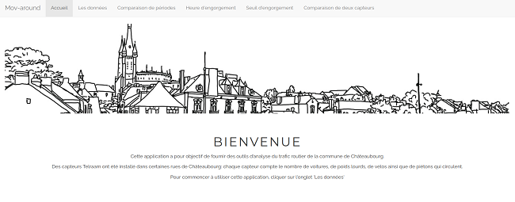
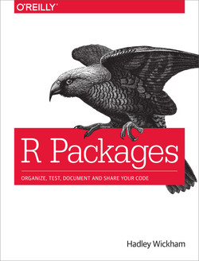
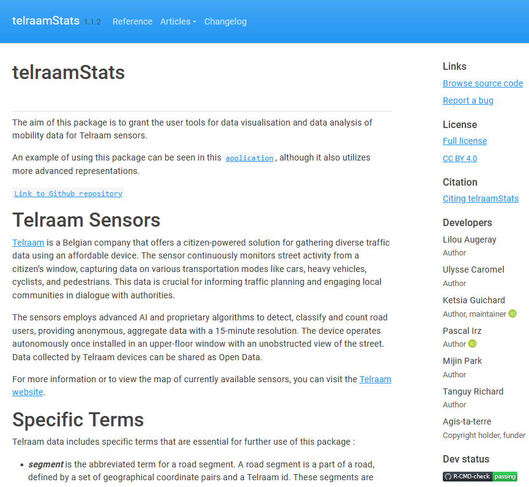
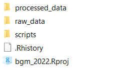
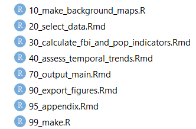
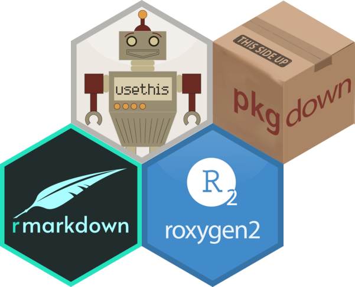
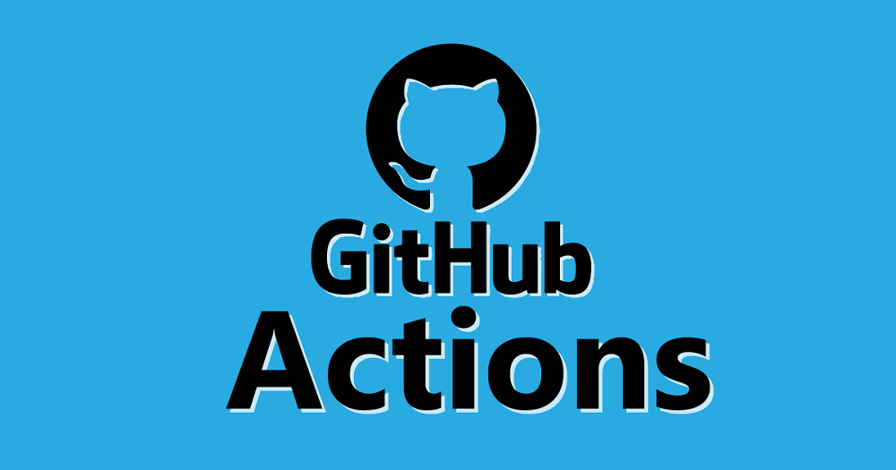
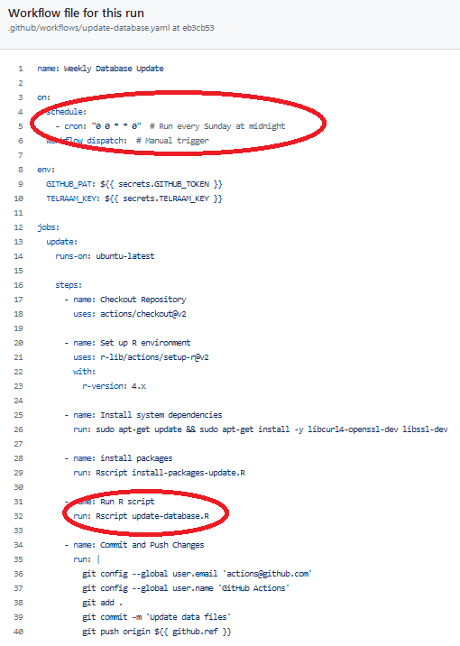

```{r setup, include=FALSE}
knitr::opts_chunk$set(echo = TRUE)
```


# Introduction

## Phasage du projet

1. Expression de besoin
2. Installation de capteurs
3. Appli mov'around, POC fonctionnel (~3000L de code, essentiellement du commentaire ligne à ligne)
4. Refonte de l'architecture (nombreuses contributions en particulier de stagiaires)
5. Publication du *package* [telraamStats](https://cran.r-project.org/web/packages/telraamStats/index.html)

{width=150px}

## Point de vue

- Un développeur R autodidacte hors thématique
- Intéressé par l'usage de la donnée
- Influencé par le mouvement pour la recherche reproductible $\Rightarrow$ intérêt aussi en ingénierie

<font size="3"> 

*Mailing list* : https://groupes.renater.fr/sympa/info/recherche-reproductible

*Exemple d'évènement* : "Bonnes pratiques pour une recherche reproductible en écologie numérique - Gestion des versions, reproductibilité, compendium et conteneurisation", Montpellier, 2-6 décembre 2024

</font size>
  
# Architecture générale

## Objectifs de la refonte

- Simplifier la maintenance (tests, débuggage, montée de versions)
- Améliorer la transférabilité
- Gagner en performance (en particulier à la connexion)

## Principe

- Subdivision du macro-projet en entités plus maniables
- Documentation

## Bénéfice secondaire

Plusieurs productions qui chacunes peuvent rentrer dans une dynamique de partage / amélioration :

- Appli
- Packages

# Application



## Peu de modifications sur les fonctionnalités ...

## ... mais sous le capot

- Simplification

  - séparation fond - forme
  - "externalisation" tout ce qui peut l'être

- Passage en structure modulaire
- Optimisation

  - pas de recalculs
  - téléchargement des données

# Package(s)

## Définition

En général, un *package* = 

- un ensemble cohérent et documenté de fonctions
- une manière simple de partager des outils
- outils de test
- possibilité de *peer-review*

## Quand est-il nécessaire de créer un package ?

- *Lorsque vous réalisez une analyse, si vous utilisez plus de deux fois une même portion de code (que vous avez “copié-collé”), vous devez créer une fonction;*
- *Si vous réutilisez une fonction entre deux analyses (en “copiant-collant” le code source de cette fonction), vous devez faire un package.*

## La référence



[Wickham, Hadley. 2015. R Packages: Organize, Test, Document, and Share Your Code. " O’Reilly Media, Inc.". ](https://www.oreilly.com/library/view/r-packages/9781491910580/)


## Programmation fonctionnelle {data-background=../assets/bg.jpg data-background-size=cover}

Subdiviser un programme qui réalise des opérations complexes en fonctions élémentaires permet de :

- travailler sur des objets plus simples (briques)
- éviter de répéter des blocs de code
- optimiser par fonction (NB en R, éviter les boucles)

## telraamStats

Package pour simplifier le téléchargement, l'analyse et la mise en forme des données produites par les [capteurs Telraam](https://telraam.net/en/what-is-telraam).

>Publication sur le CRAN en mai 2024.

{width=150px}

<font size="2">

Augeray L, Caromel U, Guichard K, Irz P, Park M, Richard T (2024). telraamStats: Retrieval and Visualization of Mobility Data from 'Telraam' Sensors. R package version 1.1.2, https://annuaire.agistaterre.org/telraamStats/.

</font>

## Un site web complet

Y compris des tutoriels !

<center>

{width=500px}

</center>

# Organisation des (sous-) projets

##

<div style="float: left; width: 50%;">

- Arborescences standards.
- Nommage explicite et cohérent des sous-répertoires, des fichiers, des fonctions, des arguments de fonctions.
- "Projet" R $\Rightarrow$ portabilité (chemins en relatif, en particulier si utilisation d'une forge).
- Pas de scripts trop longs $\Rightarrow$ 99_make.R

</div>

<div style="float: right; width: 40%;">

    

<br/><br/>



</div>


# La forme du code

##

- Standardiser le style de code (e.g. tidyverse)
- Indentation (cf. fonction d'aide "Reformat code" de RStudio)

# Documentation

## Pourquoi documenter ?

Pour permettre la maintenance et la réutilisation

$\Rightarrow$ essentiel pour tout projet 

- hors *one shot*
- et/ou mobilisant plusieurs développeurs (environ une dizaine déjà ici).

## Pour qui ? 

S'adresse aux personnes :

- assurant la maintenance
- souhaitant regarder sous le capot
- voulant réutiliser

... y compris "*the other me*" du développeur avec le nez dans le guidon.

## Quelles parties documenter ?

Des niveaux emboîtés et complémentaires : 

- **A l'intérieur du code des fonctions** : commenter à l'échelle de la ligne ou du bloc de code.
- **Métadonnées des fonctions** : expliquer à quoi sert une fonction et comment l'utiliser.
- **Métadonnées des packages et applis** : utilité, version, licence, etc. 
- **Des chaînes de traitement complètes** : tutos / vignettes

## Les outils pour documenter



# CI / CD

## Mise à jour des données

Fréquence hebdomadaire

<center>

{width=500px}

</center>

##

<center>

{width=400px}

</center>

## Versionnage et développement collaboratif

Cf. présentation de Tim.